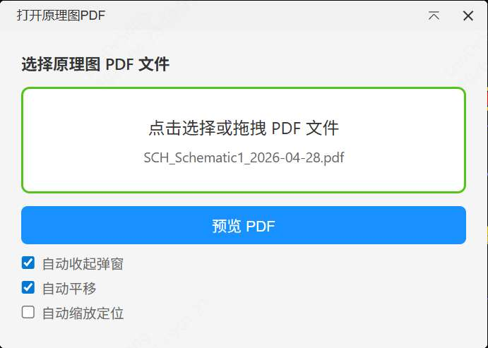
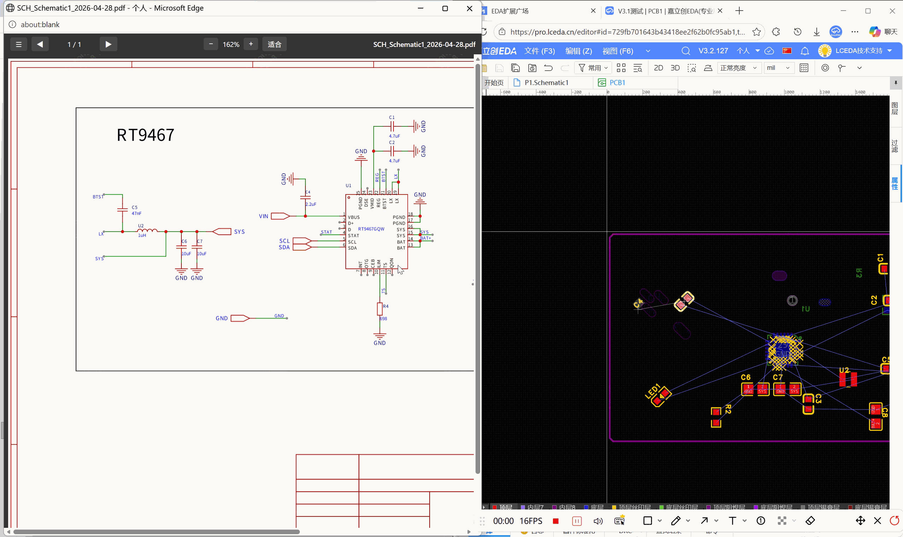

# eext-schematic-pdf-interaction

Schematic PDF Interaction Extension — Preview schematic PDFs in the PCB editor, click on component designator text to automatically select, highlight, and navigate to the corresponding PCB footprint. Ideal for scenarios where you only have a schematic PDF and need to cross-reference it with the PCB layout.

## Features

- Menu entry only appears in the PCB editor (Top Menu → Schematic PDF Interaction → Open Schematic PDF...)
- Click the menu to open an IFrame dialog (supports minimize), select a local PDF file (click or drag & drop)
- Click the "Preview PDF" button to render the PDF in a standalone browser window
- Click on a component designator text in the PDF (e.g. R1, C2, U3) to automatically select and highlight the corresponding footprint in PCB
- Three user options:
  - ☑ Auto collapse dialog (on by default) — Automatically minimize the dialog after clicking preview
  - ☑ Auto pan (on by default) — Pan the canvas to center on the component after clicking a designator
  - ☐ Auto zoom to fit (off by default) — Zoom and navigate to the component after clicking a designator
- PDF preview supports: page navigation, zoom (buttons / Ctrl+scroll), fit width, bookmark/outline navigation
- Closing the preview window automatically restores the IFrame dialog
- Clear notification when a designator is not found

## Screenshots

## Notes

- This extension only works in the browser and is not supported in the standalone desktop client
